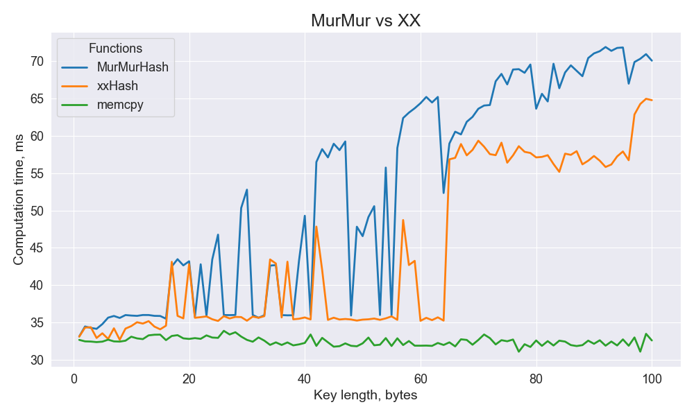

# comparison of hash functions

compared functions: [MurMurHash](https://github.com/aappleby/smhasher/blob/master/src/MurmurHash3.h) vs [xxHash](https://github.com/Cyan4973/xxHash). Reference point for comparing: `memcpy`  
Speed benchmark: [SpeedTest](https://github.com/aappleby/smhasher/blob/master/src/SpeedTest.h). For every point we take avarege of `10^7` measurements. We have built 5 graphs on each machine, they are all similar, which reduces the likelihood that you have received an incorrect result.  

Enviroment: x64, Linux and Wondows. That's why we use implementations with suffixes/prefixes such as `_x64_128 H3_128bits`.

## 1-100 (step = 1)

<table>
  <tr>
    <td align="center">Mishok</td>
    <td align="center">Ilbro</td>
  </tr>
  <tr>
    <td></td>
    <td></td> 
  </tr>
</table>

## 100-1000 (step = 50)

<table>
  <tr>
    <td align="center">Mishok</td>
    <td align="center">Ilbro</td>
  </tr>
  <tr>
    <td></td>
    <td></td> 
  </tr>
</table>
