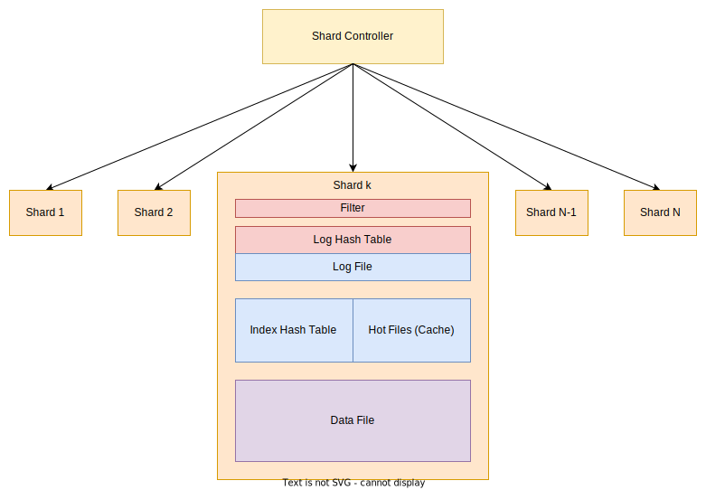

# KVik, key value store

This small library was written with following purpose: to create memory efficient, fast and yet simple key value store
that is able to store huge amount of records

## Notes

This storage doesn't support values with variable length by default, possible approaches to get around are:

 - Use fixed size that is sufficient for all your values (can be really inefficient for situations when most of your values are small)
 - Build modification on top of this implementation to support it (update operations will be a bit more complicated, maybe some other insignificant changes)

By default, expected `key` size is `128` bits and expected `value` size is `2` kilobytes.

## Architecture

By red color we will denote everything that is stored in `DRAM`, blue will stand for `SSD` storage, purple means that component is stored in `HDD`.

Thus, general architecture is as follows

  

Now let's see what each element of diagram is responsible for

### Shard controller

In order to distribute requests on independent workers for each key that comes as a part of request (`get`, `insert`, `update`, `delete`) we calculate its hash (`XXH32`)
 and choose bucket depending on range where this hash appeared to be (for example, if we have 10 shards, then each of those will theoretically be responsible for approximately `429496729` entries). By doing this, we decrease sizes of files on each shard linearly (with respect to number of shards in assumption that hashes will be distributed uniformly). 
In addition, this idea helps to increase throughput of storage (requests can be handled in parallel in different threads).

### Filter

As in all key value stores that are used in practice, we try to filter out requests with keys that aren't in store yet for `delete`, `update` and `get` requests.

There are several ways to do it but in out case it was decided to use Bloom's filter since it only requires `O(n)` bits of memory and is pretty fast.

Our filter was designed to have small error probability (less than `9%`), it happens when we have `4` [4-independent](https://en.wikipedia.org/wiki/K-independent_hashing) hash functions. And number of bits is about `5n` where `n` is number of entries stored in **KVik**.

To make filtering really fast, it is, of course, stored in `DRAM` (also, it is easily recovered when we have all data from persistent storage devices like SSD and HDD).

### Log Hash Table

As a request comes it is firstly added to `Log Hash Table` which is basically open addressing hash table that is using [Robin Hood hashing](https://programming.guide/robin-hood-hashing.html). This technique helps `Log Hash Table` to be more memory efficient and maintain fill factor around `90%`.

`Log Hash Table` has a fixed size, so when it is filled it is merged into `Index Hash Table` as well as corresponding `Log File` is merged into `Hot Files`

`Log Hash Table` stores key + offset of corresponding value in `Log File`.

### Log File

`Log File` stores `(key, value)` pairs corresponding to keys that are stored in `Log Hash Table`, it is pretty simple really. Keys are stored to increase fall tolerance because in other case when electricity wil be cut off values will remain (since they are stored on `SSD` which in energy independent) whereas keys that are stored in `Log Hash Table` will be lost, we want to avoid situations like that.

### Index Hash Table

`Index Hash Table` is responsible for all keys that are not in the `Log Hash Table`. Its function is very simple, it maintains set of keys and maps them to two offsets, offset in `Hot Files` and offset in `Data File` (how exactly they are stored is implementation detail really). 

This hash table has the following property: each bucket is just one memory page (`4 KB`). When page is filled hash table is rebuilt. To avoid problems with bucket overflow during rehashing, if it happens one more memory page will be allocated for this bucket and will be linked to existing pages in this bucket (like in hash table with closed addressing). But after add operation to this bucket it will be detected and rehashed again (we just hope that after rehashing it all be distributed more uniformly in expanded hash table).

Experiments showed the following (number of entries in hash table was up to `2 * 10^8`, 128-bit words were generated by `rand` and `std::mt19937`, hashing that was used is `XXH32` with random seed):

- If one memory page is being used fill factor is more than 60% (experiments showed numbers between 62 and 70 depending on number of entries and varied between different attempts)
- If ten memory page is being used fill factor is more than 85% (experiments showed numbers between 85 and 90 depending on number of entries and varied between different attempts) but you should be careful with that because if number of pages gets bigger so does `Read Amplification Factor` and `Write Amplification Factor` (But yes, `Space Amplification Factor` gets smaller)

### Hot Files

Conceptually, it is cache for values of keys that are used most often. This strategy will most likely be implemented in the future but for now `Hot Files` will be some kind of intermediate value storage that is a lot faster than storage on `HDD` (although [this document](https://gist.github.com/jboner/2841832) is 2012 version, relation between `HDD` and `SSD` access latency is still pretty huge).

`Hot Files` should also store keys in addition to values. It is done for more efficient merge operation to `Data File` (update entry in `Index Hash Table` and check if some information corresponding to this key is already in `Data File` so we can just replace this value with a new one)

### Data File

Data File is one huge file that is stored on `HDD`. It also maintains linked list of deleted entries so that it is easy to put new values on place of deleted ones.

It doesn't store any additional data, only values.

## API

This storage supports basic operations that any associative container supports: `get`, `insert`, `update`, `delete`. It is really unlikely that it can be used as a database for your application. But, of course, since it doesn't introduce additional complexity for supporting custom user requests written in somewhat like SQL, it should be faster.

So, if you actually don't need anything more complex than these operations, **KVik** is a viable option for you.

### Get

Here is how `get` operation works in **KVik**: 
1. filter is applied, if it says that value isn't in storage we return `nullptr` immediately (with probability around `91%` for values that are not in storage it will work properly and say so)
2. request is passed to `Log Hash Table` and it is checked if such key is present there. If so, read corresponding value from `Log File` and return to user.
3. request is passed to `Index Hash Table` and it is checked if such key is present in there. If so, if it has offset in `Hot Files` present, read value from there, otherwise read it from `Data File`.

### Insert

Here is how `insert` operation works in **KVik**: just insert it into `Log Hash Table` and set bits corresponding to this key in filter to ones.

Interesting part is how merge operation works because obviously, since `Log Hash Table` is in `DRAM` it will be filled pretty quick. Well, it is also pretty easy actually, keys are sorted in ascending order of hash function that is used in `Index Hash Table`. After that values are inserted as they would be in any ordinary hash mao. The idea of this sorting is to have some keys hit same buckets and therefore using fewer operations with disk.

Another interesting merge is `Hot Files` with `Data File`. Here merge is done very straightforward way: just traverse all records in `Hot Files` and insert them into `Data File` one by one.

### Update

`update` operation is very similar to `insert`. The only important difference is that before actually updating record we apply filter. If filter says that record is definitely not in storage we ignore it. If `update` operation is called you must be sure that record is already in the storage (however, this behavior can be modified in the future, be careful with updating library to newer version, read patch notes carefully beforehand).
